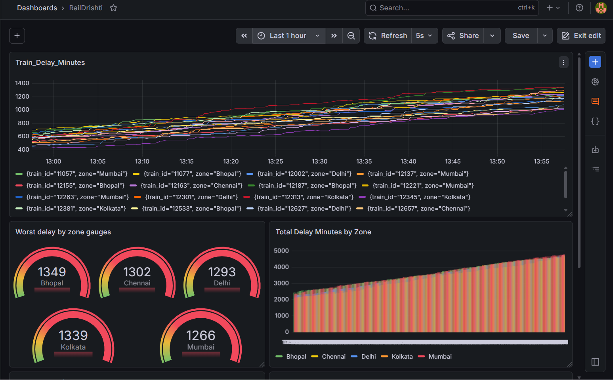
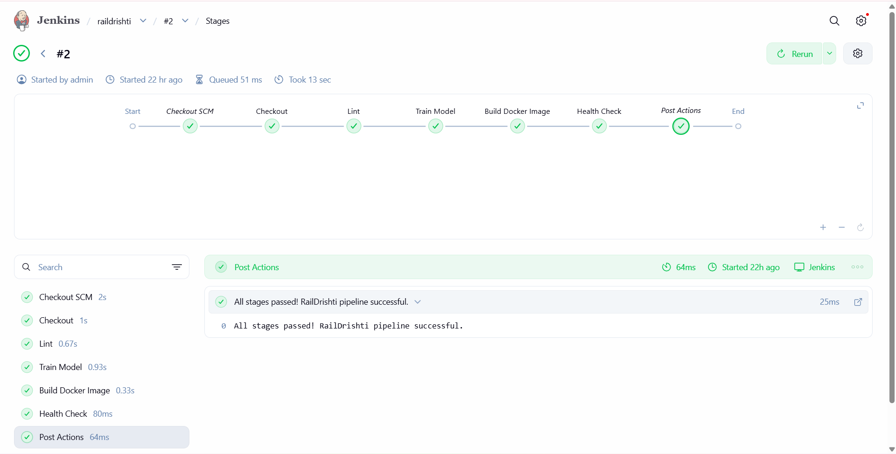
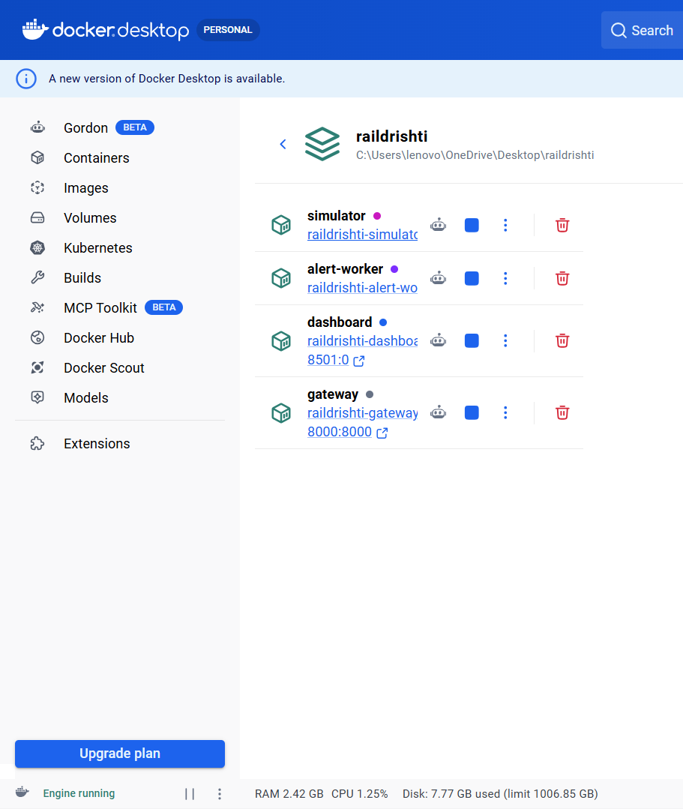
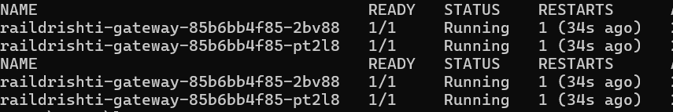
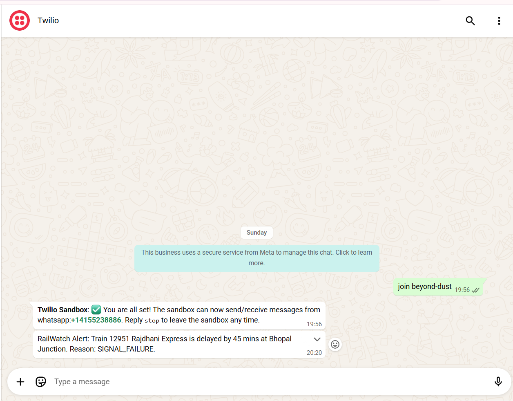
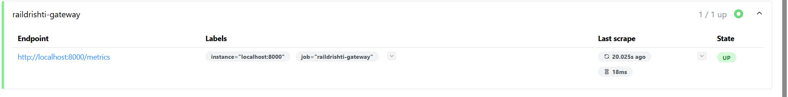
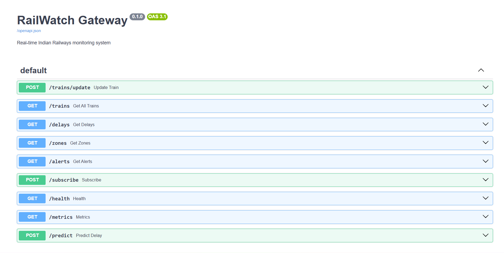

# RailDrishti — Real-Time Indian Railways Delay Prediction System

A production-grade ML powered monitoring platform that tracks 20 Indian trains across 5 railway zones in real time, predicts delay probability using a Random Forest model, fires WhatsApp alerts when trains exceed 30 minutes delay, and visualizes everything on a live Grafana dashboard.

---

## Screenshots









---

## What it does

RailDrishti simulates 20 trains across 5 Indian railway zones — Delhi, Mumbai, Chennai, Kolkata, and Bhopal. Each train sends live telemetry every 5 seconds including current station, delay in minutes, and reason code. A Random Forest ML model trained on 10,000 historical records predicts whether any given train will be on time, minor delayed, major delayed, or severely delayed. When a train crosses 30 minutes delay, the system automatically fires a WhatsApp alert to subscribed passengers via Twilio.

---

## Architecture

```
simulator.py (20 threads)
      |
      | POST /trains/update every 5 seconds
      |
app/main.py (FastAPI Gateway)
      |
      |--- SQLite database (stores all telemetry)
      |--- ML model (predicts delay category)
      |--- Prometheus metrics (/metrics endpoint)
      |--- Alert creation (delay > 30 min)
      |
      |--- GET /trains (Streamlit dashboard reads this)
      |--- GET /metrics (Prometheus scrapes this)
      |
app/alert_worker.py
      |
      | Twilio WhatsApp API
      |
Passenger phone

Prometheus (scrapes every 15s) --> Grafana (live dashboards)
```

---

## Stack

| Tool | Purpose |
|---|---|
| Python 3.11 + FastAPI | REST gateway, anomaly detection, ML serving |
| scikit-learn | Random Forest delay prediction model |
| Streamlit | Live auto-refreshing dashboard |
| SQLite | Telemetry and alert storage |
| Twilio | WhatsApp alert delivery |
| Docker | 4 containerised services |
| Jenkins | CI/CD pipeline with 5 stages |
| Kubernetes (Minikube) | Pod orchestration, auto-scaling, self-healing |
| Prometheus | Metrics scraping every 15 seconds |
| Grafana | Live visualisation dashboards |
| Git + GitHub | Version control |

---

## ML Model

The delay prediction model is a Random Forest classifier trained on 10,000 synthetic historical train records.

Features used for prediction:
- Railway zone (Delhi, Mumbai, Chennai, Kolkata, Bhopal)
- Train type (Superfast, Express, Mail, Shatabdi, Duronto)
- Hour of day
- Day of week
- Season (Summer, Monsoon, Winter, Spring)

Target classes: ON_TIME, MINOR_DELAY, MAJOR_DELAY, SEVERELY_DELAYED

Model accuracy: 76%

Feature importance:
- Hour of day: 30.5%
- Season: 26.6%
- Day of week: 16.3%
- Train type: 14.3%
- Zone: 12.3%

---

## The 20 Trains

| Zone | Trains |
|---|---|
| Delhi | 12951 Rajdhani Express, 12002 Bhopal Shatabdi, 12627 Karnataka Express, 12301 Howrah Rajdhani |
| Mumbai | 12137 Punjab Mail, 11057 Amritsar Express, 12263 Pune Duronto, 12221 Rajkot Express |
| Chennai | 12163 Chennai Express, 12695 Trivandrum Express, 12657 Bangalore Mail, 12671 Nilagiri Express |
| Kolkata | 12313 Sealdah Rajdhani, 12381 Poorva Express, 13049 Amritsar Express, 12345 Saraighat Express |
| Bhopal | 12155 Bhopal Express, 12533 Pushpak Express, 11077 Jhelum Express, 12187 Jabalpur Express |

---

## API Endpoints

| Endpoint | Method | Description |
|---|---|---|
| /trains/update | POST | Receives live telemetry from simulators |
| /trains | GET | Returns latest status for all 20 trains |
| /delays | GET | Returns trains above a delay threshold |
| /zones | GET | Returns health score per zone |
| /alerts | GET | Returns recent delay alerts |
| /predict | POST | Returns ML delay prediction with confidence |
| /subscribe | POST | Subscribe phone number for WhatsApp alerts |
| /health | GET | Health check for Jenkins and Kubernetes probes |
| /metrics | GET | Prometheus scrape endpoint |

---

## Jenkins Pipeline

5 stages run automatically on every push to main:

1. Checkout — pulls latest code from GitHub
2. Lint — runs flake8 Python code quality check
3. Train Model — generates data and retrains ML model
4. Build Docker Image — builds container image
5. Health Check — verifies deployment is live

---

## Kubernetes

Resources deployed to Minikube:

- Deployment — 2 replicas with liveness and readiness probes on /health
- Service — NodePort service exposing the gateway
- HPA — auto-scales 2 to 8 pods at 60% CPU utilization
- CronJob — retrains ML model every Sunday at 2am automatically

Self-healing verified: deleting a pod manually results in Kubernetes creating a replacement within 15 seconds.

---

## Project Structure

```
raildrishti/
├── app/
│   ├── main.py              # FastAPI gateway with ML integration
│   ├── simulator.py         # 20 train threads sending live data
│   ├── dashboard.py         # Streamlit live dashboard
│   └── alert_worker.py      # Twilio WhatsApp alert sender
├── model/
│   ├── generate_data.py     # Generates 10,000 training records
│   ├── train_model.py       # Trains Random Forest, saves model.pkl
│   ├── delay_model.pkl      # Trained model
│   └── le_*.pkl             # Label encoders
├── data/
│   └── train_history.csv    # Training dataset
├── k8s/
│   ├── deployment.yaml
│   ├── service.yaml
│   ├── hpa.yaml
│   └── cronjob.yaml
├── monitoring/
│   └── raildrishti-dashboard.json
├── Dockerfile
├── docker-compose.yml
├── Jenkinsfile
├── requirements.txt
└── .gitignore
```

---

## How to Run Locally

```bash
git clone https://github.com/Adityasrivastava28/raildrishti.git
cd raildrishti
python -m venv venv
venv\Scripts\activate
pip install -r requirements.txt
python model/generate_data.py
python model/train_model.py
```

Terminal 1 — Gateway:
```bash
uvicorn app.main:app --reload --port 8000
```

Terminal 2 — Simulator:
```bash
python app/simulator.py
```

Terminal 3 — Dashboard:
```bash
streamlit run app/dashboard.py
```

Terminal 4 — Alert worker:
```bash
python app/alert_worker.py
```

## Run with Docker

```bash
docker-compose up --build
```

All 4 services start automatically.

---

## URLs

| Service | URL |
|---|---|
| Streamlit dashboard | http://localhost:8501 |
| FastAPI docs | http://localhost:8000/docs |
| Prometheus | http://localhost:9090 |
| Grafana | http://localhost:3000 |
| Jenkins | http://localhost:8888 |

---

## Built by

Aditya Srivastava

Two DevOps projects built from scratch without watching a single tutorial. Learning by building.

GitHub: github.com/Adityasrivastava28
